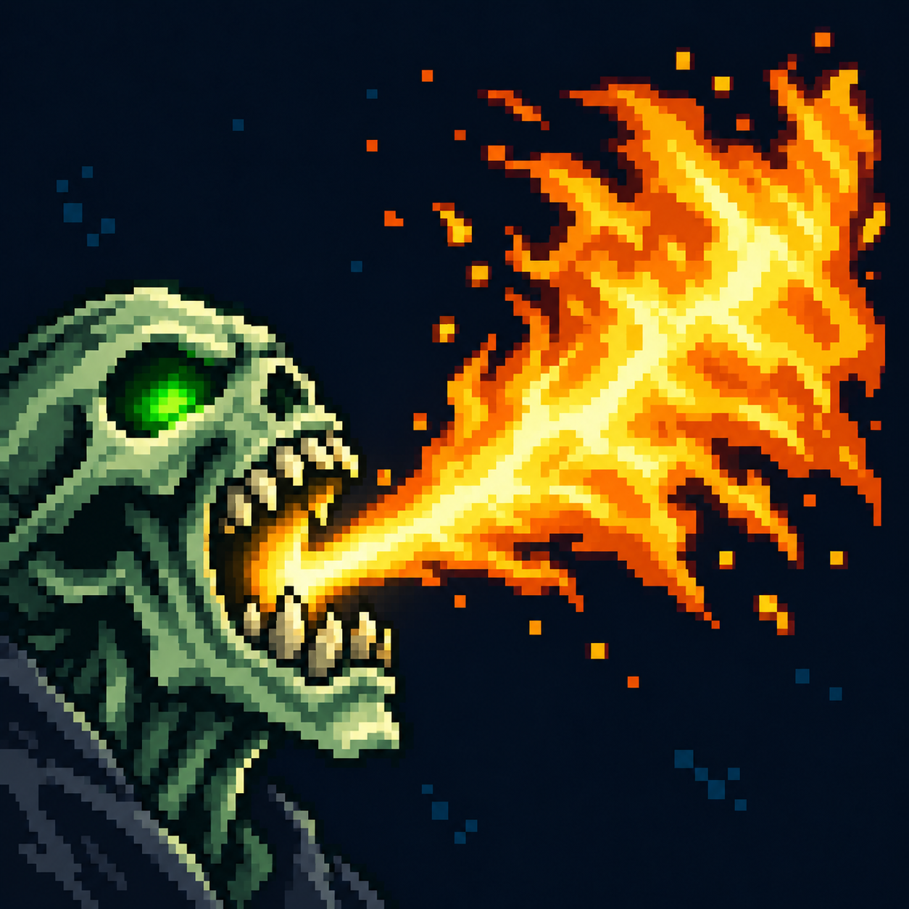

# Короткий огненный выдох

Статус: **candidate**, художественный референс для проверки пользователем.

Пиксельная иконка проверена на соответствие источнику, траектории и моменту действия способности.

Страница CubeSiege: [Короткий огненный выдох](https://chatgpt.com/space/page_de0c96cedcd881918c5ea95cb92489e8).

Происхождение и параметры: `provenance.json`; точный промпт: `prompt.txt`; наблюдения: `inspection.json`.
