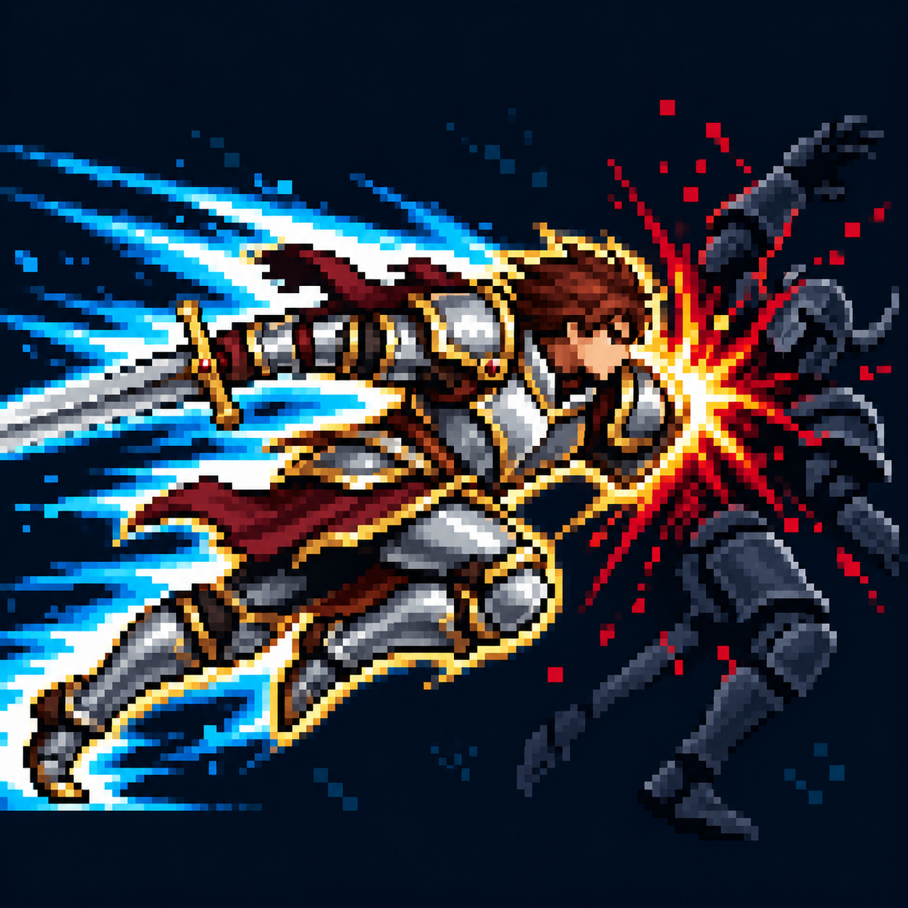

# Опасные движения

Статус: **candidate**, художественный референс для проверки пользователем.

Защищённый рывок наносит урон противнику на пути перемещения.

Страница CubeSiege: [Опасные движения](https://chatgpt.com/space/page_f286efd7b44881918672859e1ce38dac).

Происхождение и параметры: `provenance.json`; точный промпт: `prompt.txt`; наблюдения: `inspection.json`.
