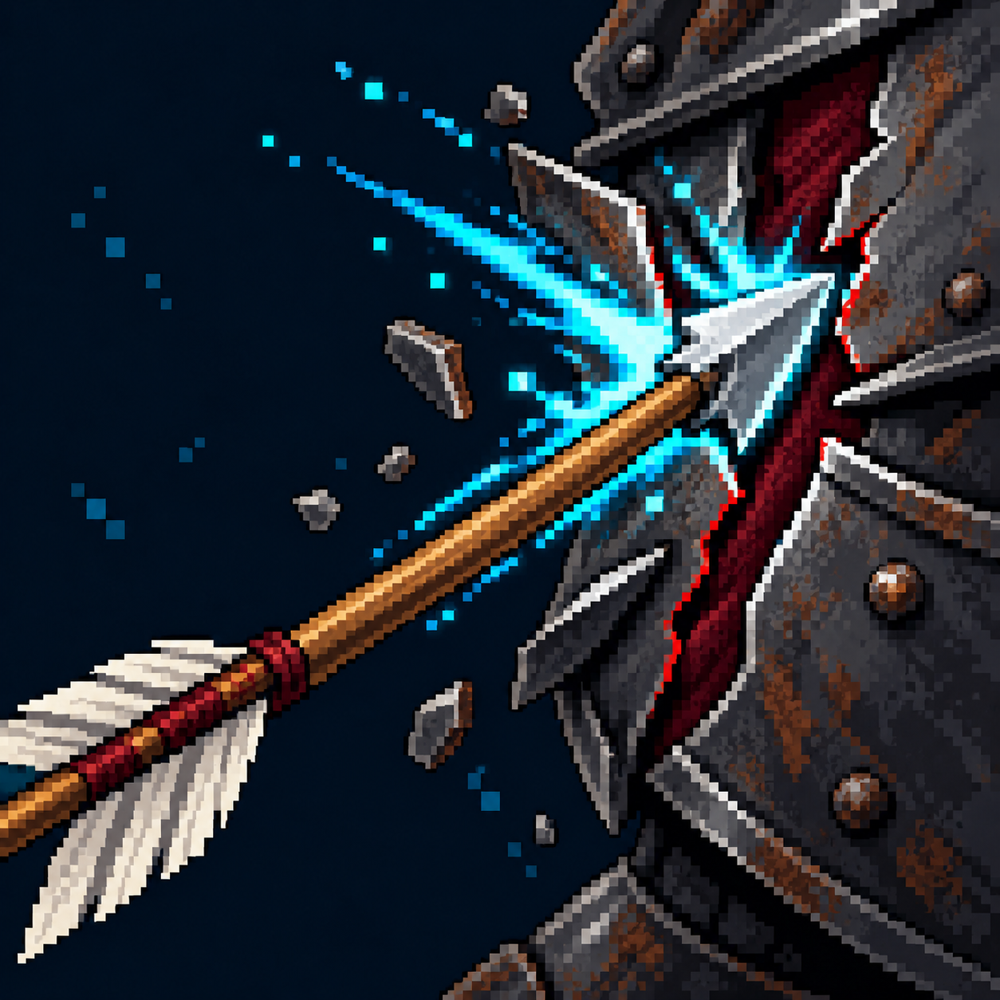

# Срез брони — визуальная идея

Статус: **candidate**, художественный референс для проверки пользователем.

Раскол находится в точке контакта наконечника с бронёй; величина снижения не изображена. Референс существующего направления мутации; отдельный талант и параметры ещё не утверждены.

Страница CubeSiege: [Срез брони — визуальная идея](https://chatgpt.com/space/page_5e44bec4e58881918d12ee0803e1d69d).

Происхождение и параметры: `provenance.json`; точный промпт: `prompt.txt`; наблюдения: `inspection.json`.
