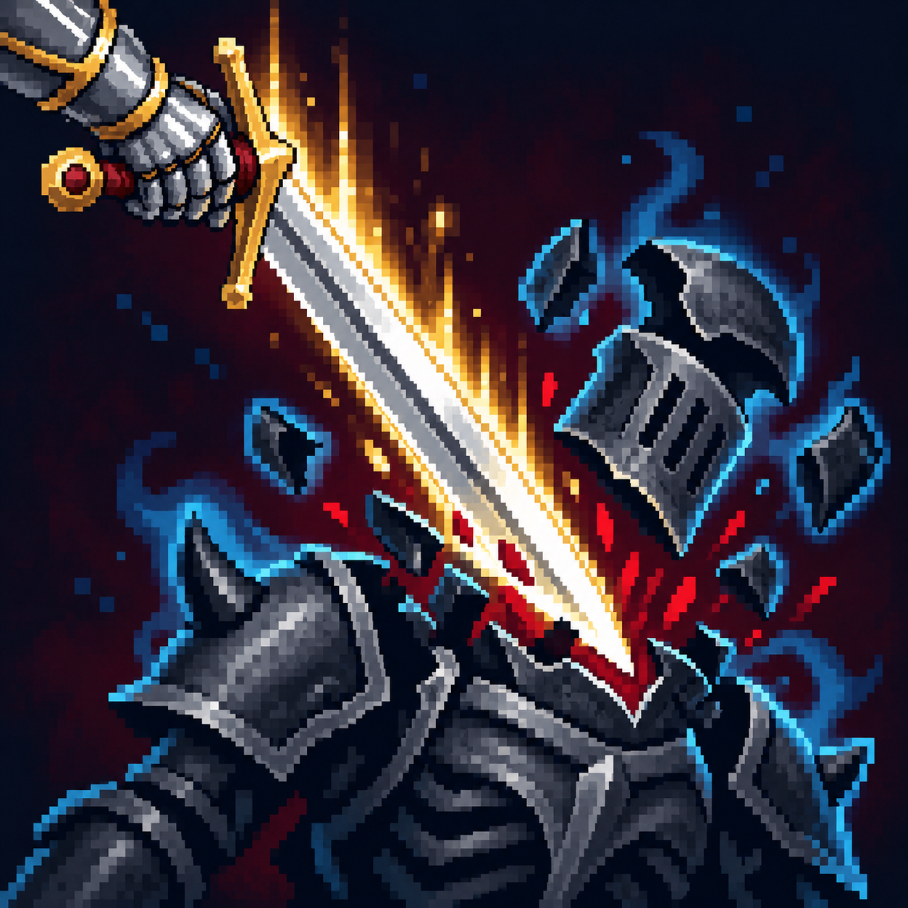

# Расчленение трупа

Статус: **candidate**, художественный референс для проверки пользователем.

Победа над дуэльной целью: разлетающиеся части брони и тёплый акцент победы.

Страница CubeSiege: [Расчленение трупа](https://chatgpt.com/space/page_7c5f514792648191bf4c13a276421619).

Происхождение и параметры: `provenance.json`; точный промпт: `prompt.txt`; наблюдения: `inspection.json`.
