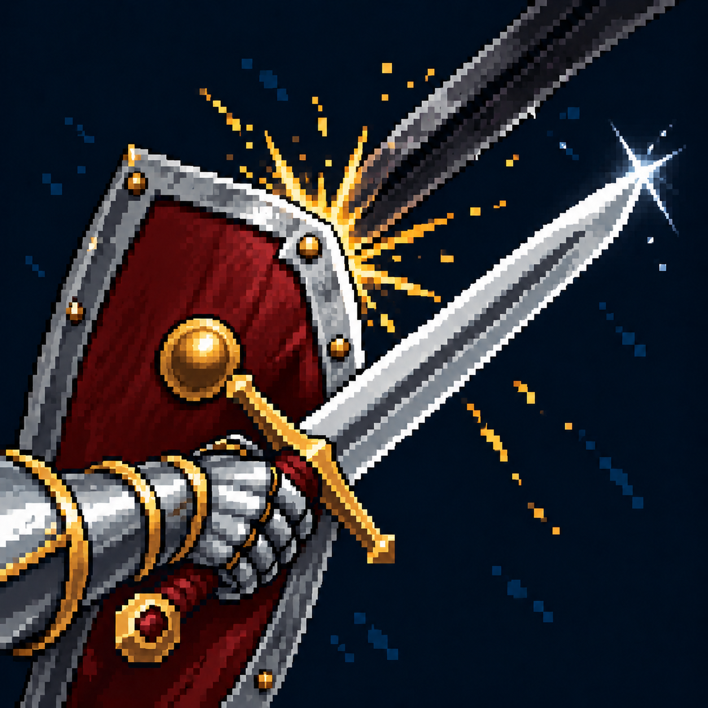

# Контратака

Статус: **candidate**, художественный референс для проверки пользователем.

Щит перехватывает удар, собственный меч выходит вперёд для ответной атаки.

Страница CubeSiege: [Контратака](https://chatgpt.com/space/page_20d505f46b8c8191a38d9a7b3c46184c).

Происхождение и параметры: `provenance.json`; точный промпт: `prompt.txt`; наблюдения: `inspection.json`.
