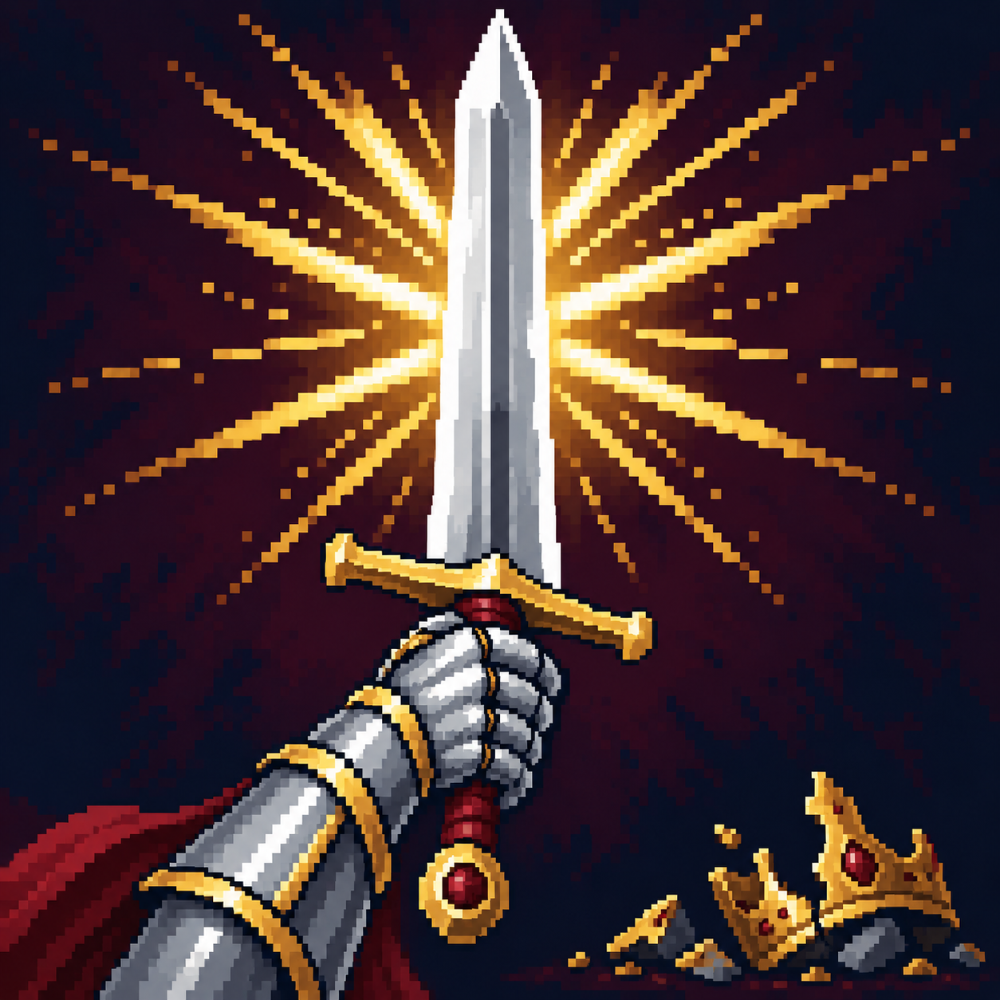

# Громкий триумф

Статус: **candidate**, художественный референс для проверки пользователем.

Поднятый меч и золотые лучи обозначают наступательное усиление после победы.

Страница CubeSiege: [Громкий триумф](https://chatgpt.com/space/page_87b33a394a088191b374285ad874deb1).

Происхождение и параметры: `provenance.json`; точный промпт: `prompt.txt`; наблюдения: `inspection.json`.
