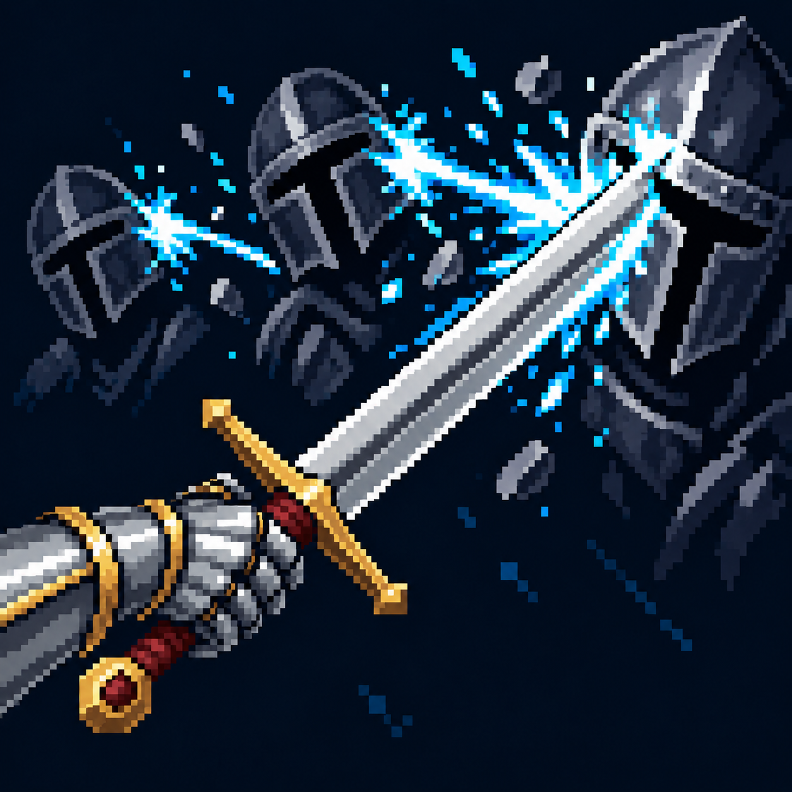

# Разящий удар

Статус: **candidate**, художественный референс для проверки пользователем.

Попадание по основной цели с коротким сплэшем по соседним противникам.

Страница CubeSiege: [Разящий удар](https://chatgpt.com/space/page_a955100753708191911e60504137b50b).

Происхождение и параметры: `provenance.json`; точный промпт: `prompt.txt`; наблюдения: `inspection.json`.
