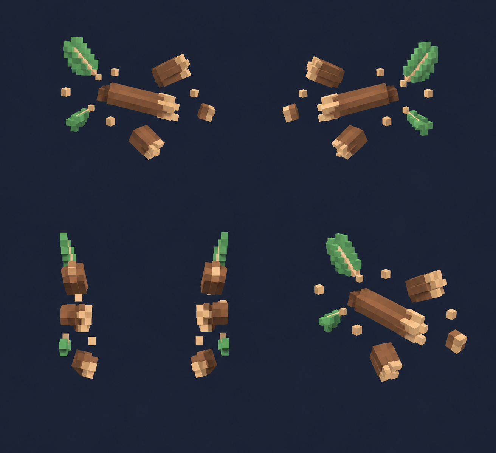

# Осколочные щепы — концепт частиц — 5 видов

Статус: **candidate**, художественный референс для проверки пользователем.

Пять ракурсов одного объекта/момента в крупной воксельной стилистике. Художественный референс; правила срабатывания берутся из текста способности, анимация и читаемость в движке не проверены. Концепт существующей идеи мутации без назначения нового таланта или параметров.

Страница CubeSiege: [Осколочные щепы — концепт частиц — 5 видов](https://chatgpt.com/space/page_5e44bec4e58881918d12ee0803e1d69d).

Происхождение и параметры: `provenance.json`; точный промпт: `prompt.txt`; наблюдения: `inspection.json`.
