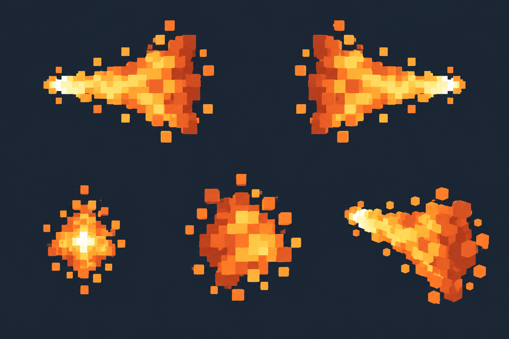

# Огненный выдох — короткий конус — 5 видов

Статус: **candidate**, художественный референс для проверки пользователем.

Пять ракурсов одного объекта/момента в крупной воксельной стилистике. Художественный референс; правила срабатывания берутся из текста способности, анимация и читаемость в движке не проверены.

Страница CubeSiege: [Огненный выдох — короткий конус — 5 видов](https://chatgpt.com/space/page_de0c96cedcd881918c5ea95cb92489e8).

Происхождение и параметры: `provenance.json`; точный промпт: `prompt.txt`; наблюдения: `inspection.json`.
