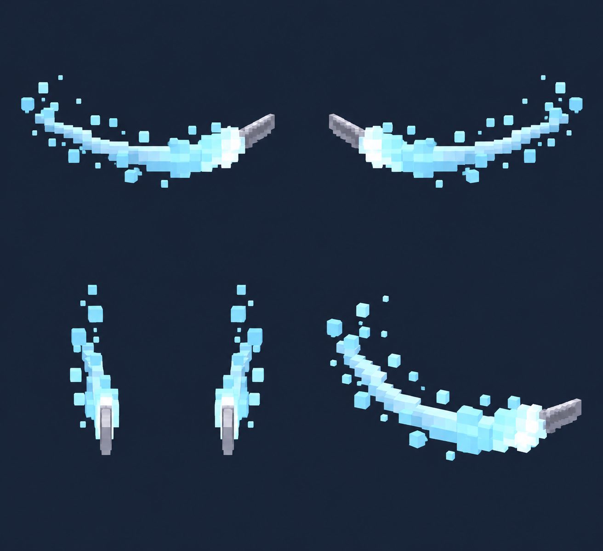

# Удар мечом — след режущей кромки — 5 видов

Статус: **candidate**, художественный референс для проверки пользователем.

Пять ракурсов одного объекта/момента в крупной воксельной стилистике. Художественный референс; правила срабатывания берутся из текста способности, анимация и читаемость в движке не проверены.

Страница CubeSiege: [Удар мечом — след режущей кромки — 5 видов](https://chatgpt.com/space/page_1b033b6408a88191962d4ad00f4aeb0a).

Происхождение и параметры: `provenance.json`; точный промпт: `prompt.txt`; наблюдения: `inspection.json`.
