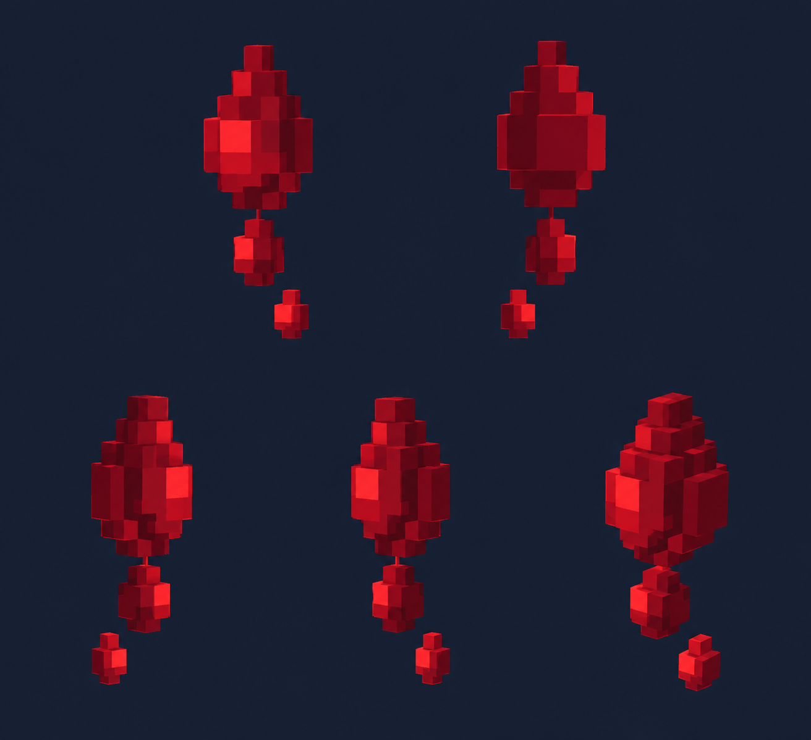

# Кровотечение — VFX

Статус: **candidate**, художественный референс для проверки пользователем.

Пять пространственных ракурсов эффекта в один момент. Крупные воксельные частицы, однотонный контрастный фон; без персонажа и ландшафта. Анимация и читаемость в движке не проверены.

Страница CubeSiege: [Кровотечение — VFX](https://chatgpt.com/space/page_934e834252448191a9fc5ec0c7d120b8).

Происхождение и параметры: `provenance.json`; точный промпт: `prompt.txt`; наблюдения: `inspection.json`.
