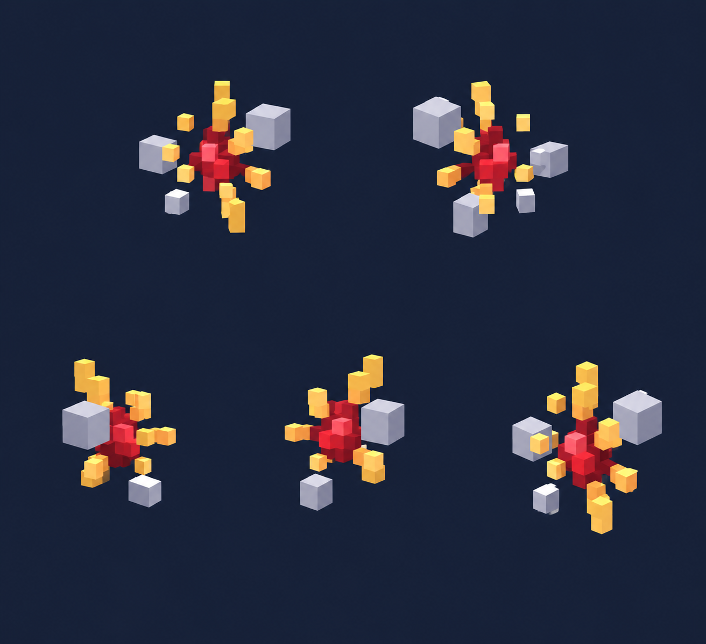

# Снижение входящего урона — VFX

Статус: **candidate**, художественный референс для проверки пользователем.

Пять пространственных ракурсов эффекта в один момент. Крупные воксельные частицы, однотонный контрастный фон; без персонажа и ландшафта. Анимация и читаемость в движке не проверены.

Страница CubeSiege: [Снижение входящего урона — VFX](https://chatgpt.com/space/page_f42c321c1d088191b0b851e9c34abe29).

Происхождение и параметры: `provenance.json`; точный промпт: `prompt.txt`; наблюдения: `inspection.json`.
